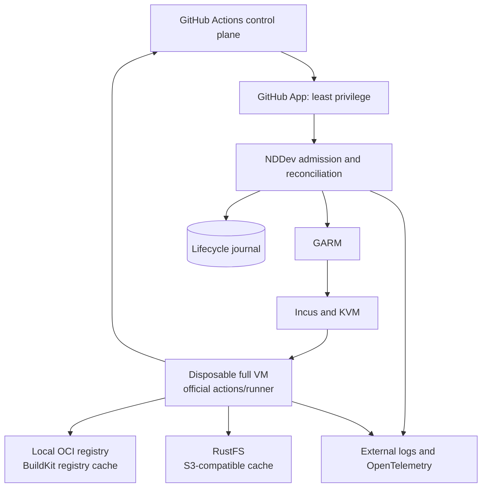

# Architecture

Status: accepted. This file describes what is stable about the design;
[current state](STATUS.md) records what is deployed.

## Outcome

The platform runs GitHub Actions jobs with the official runner inside a fresh
Incus/KVM full VM. GARM remains the upstream management plane. NDDev code adds
policy compilation, resource-aware admission, lifecycle durability,
reconciliation, warm-pool control, telemetry and cache integration.

The design optimizes the hot path without taking ownership of GitHub's runner
protocol or Actions semantics.

[ADR 0035](adr/0035-cross-platform-multi-tenant-control-plane.md) defines the
cross-platform topology: Example legacy is operator ingress rather than an execution
host, Linux uses the current disposable Incus backend, macOS and Windows remain
GitHub-hosted until separate native backends pass the same lifecycle contract,
and every self-hosted backend shares durable tenant-aware admission and
OpenObserve correlation.



## Responsibility boundaries

| Component | Owns | Must not own |
| --- | --- | --- |
| GitHub | Workflow orchestration, queue, job assignment, UI, artifacts | VM lifecycle and local cache health |
| Official runner | Steps, expressions, actions, containers, cancellation, outputs, post-actions | Host provisioning and cross-repository scheduling |
| GARM | GitHub pool/webhook integration and provider orchestration | Actions execution semantics |
| NDDev control plane | Admission, durable lifecycle, reconciliation, fairness, reason codes, telemetry | GitHub Actions YAML interpretation |
| Incus/KVM | Full-VM lifecycle, devices, CPU/RAM/disk/network boundaries | GitHub identity and cache policy |
| RustFS | S3-compatible compiler and content-addressed objects | OCI distribution and mutable release inputs |
| OCI registry/BuildKit | Image pulls and registry-backed layer cache | Compiler cache objects |

This repository owns portable implementation, schemas, tests, architecture and
the deployment contract every fleet host runs, which lives under
`deploy/fleet-host/`. What stays out of it is per-host secret material and the
discovered facts of a particular machine: credentials, PKI, environment files
and the addresses a host was provisioned with.

## Job path

1. A pre-booted VM exists in `available-warm`. It contains no runner
   registration, repository identity or job credential.
2. A sparse `JobAssigned` Scale Set message is normalized with the canonical
   repository-scoped GARM entity to `(scale_set_id, job_id)` and durably admitted
   before desired capacity is changed. Workflow metadata and its later numeric
   `runnerRequestId` are bound from `JobAvailable` before `AcquireJobs`.
   Webhook-driven fallback pools use
   `(repository_id, workflow_job_id, run_attempt)` instead.
3. Central admission applies the global budget, repository quota, priority
   aging and durable weighted stride order. A non-selected request remains in
   GitHub's queue.
4. Provider admission checks pool quota, host health, CPU-unit reserve, memory
   reserve, disk pressure, trust policy and image health.
5. The VM is bound durably to exactly one job attempt.
6. One-job JIT configuration is requested and injected over the bootstrap
   channel. It is never baked into the image.
7. The official runner registers, receives one job and executes it.
8. Completion, failure or cancellation moves the VM to diagnostics collection.
9. Runner diagnostics and console logs are exported outside the VM.
10. Runner registration, VM, disks and transient network resources are removed.
11. Warm capacity is replenished with a new clone. An executed VM is never
    returned to the pool.

Step 7 is why the original sub-five-second warm target was retired rather than
missed: an unregistered warm VM performs runner registration and broker connect
on the critical path, which a GitHub-hosted runner has already done. That floor
is a consequence of step 1 holding no registration, so moving it is a
threat-model decision. `docs/roadmap.md` records the measurements that replaced
the single target.

## Trust and workload pools

| Scale Set name | Intended workload | Host | Important boundary |
| --- | --- | --- | --- |
| `nddev-linux-fast` | format, lint, typecheck, short unit tests | `gha-runner-3` | no job credential, no Docker |
| `nddev-linux-standard` | normal builds and tests | `gha-runner-1` | repository-scoped credentials |
| `nddev-linux-integration` | Docker, Compose, databases, browsers | `gha-runner-2` | Docker daemon exists only inside VM |
| `nddev-linux-release` | signing, publish, deploy | none | isolated group, OIDC-only, egress allowlist |

A scale set name is unique per forge entity, so one host serves one name and
the table above is also the host map. Warm targets live in each host's
configuration rather than here, because they move with measurement.

The fast pool once claimed a narrower egress than the others. It asked for a
`github-cache-only` policy that no bridge implements, so the planner refused to
build it and the pool held zero capacity everywhere; the zero read as caution
rather than as the impossibility it was. The policy was also wrong for the
work, because a linter resolves dependencies from npm and PyPI that neither
GitHub nor the local cache serves. What the pool keeps is what it can enforce:
no job credential, no Docker, and the same bounded public egress every pool
gets, where the ACL rejects private, metadata, multicast and host ranges before
any allow is considered. The release pool still names an allowlist it does not
have, which is why it still holds no capacity.

`internal/incusplan` now refuses to let those two states be confused: a pool
that declares warm capacity must be plannable, while a pool with none may name
a policy that is still an intent.

Public and fork pull requests stay on GitHub-hosted runners during the pilot.
If an untrusted local pool is added later, it must have no secrets, no private
routes and only an isolated writable cache namespace.

Pool sizes are declared per host in `config/server-*.yaml` and are conservative
bootstrap ceilings for the hardware each host actually has. They allow one cold
worker. Warm capacity and concurrency are promoted only after benchmark gates.
A new host requires a new measured profile; capacity is never copied from
another host or from a marketing size.

A host declares a reserve mode, and the mode changes what admission may
conclude from load. A `retained-workloads` host shares capacity with processes
outside the fleet, which the admission journal cannot see because it accounts
only for fleet VMs, so observed load remains a blocking signal there. On a
`dedicated` host the fleet is the only consumer and the journal already holds
exact CPU-unit accounting, so load is delegated to it rather than treated as a
second, lagging gate that a refused create would only raise.

## Resource model

The initial scheduler accounts one VM vCPU as one non-overcommitted CPU unit.
On dedicated hardware that unit is a physical core; on the current DigitalOcean
guest it is one provider vCPU. The scheduler preserves the greater of an
absolute reserve and ten percent of host capacity. It also preserves at least
16 GiB RAM and blocks admission below 20 percent free disk.

No CPU overcommit or memory ballooning is allowed before saturation tests show
acceptable p95 behavior. Heavy workers should remain inside one NUMA domain
where the host topology permits it.

The central scheduler implements durable weighted stride fairness,
per-repository limits and priority for main, merge queue and release before
`AcquireJobs`. Its global budget is per host and is currently one, because one
safe cold-worker slot is what the measured hardware supports. A separate
integration budget becomes meaningful only after measured capacity exceeds
one. GitHub workflow concurrency cancellation
remains the first defense against agent-driven commit storms.

## Cache planes

RustFS is the S3-compatible object backend for sccache and content-addressed
build objects. It is deployed as a separate service and receives scoped access
keys through runtime secret locators. The repository never stores access keys.

The namespace includes:

```text
organization/repository/trust/platform/architecture/toolchain/lock_digest/ref_class
```

Untrusted writes use a disposable or isolated namespace. Release workers cannot
write shared cache entries and may only read promoted immutable inputs.

OCI manifests and BuildKit layers remain in a local registry because registry
cache semantics differ from generic S3 objects. RustFS is not used as a hidden
replacement for every cache protocol.

## Images and updates

Golden images are reproducible and addressed by digest. Stable toolchains,
official runner binaries, telemetry and pool-specific Docker support are baked
before promotion. Per-instance bootstrap only supplies identity and JIT data.

Promotion is:

```text
build -> scan -> parity smoke -> canary pool -> production pool
```

The previous digest remains available for rollback. Runner and provider updates
never mutate the full production fleet in place.

## Availability boundary

One runner host is one failure domain, and multiple nested VMs or managers on
one host do not change that. A GitHub runner scale set name is unique per
repository, so two hosts cannot serve one name; each host therefore holds a
different pool and is the other's failure domain for the pool it does not hold,
rather than a replica of it.

That is separation, not redundancy. A workflow pinned to one pool still has one
failure domain, and GitHub does not automatically reinterpret an unavailable
self-hosted label as `ubuntu-latest`. Critical workflows need either a second
host serving the same label or an explicit GitHub-hosted selector.

## Implementation seams

The current Go core intentionally starts below external APIs:

- `internal/config`: strict policy loading, security invariants and fingerprint;
- `internal/domain`: stable GitHub job-attempt identity;
- `internal/admission`: explainable conservative capacity decisions;
- `internal/lifecycle`: immutable worker state transitions;
- `cmd/gha-fleet`: operator validation, rendering and admission probes.

GitHub, GARM and Incus sit behind narrow interfaces in
`internal/garmbootstrap`, `internal/garmproviderincus` and
`internal/incusreconcile`. Their event payloads are translated into internal
types at the boundary, which keeps the durable state machine testable without
running untrusted upstream code.
